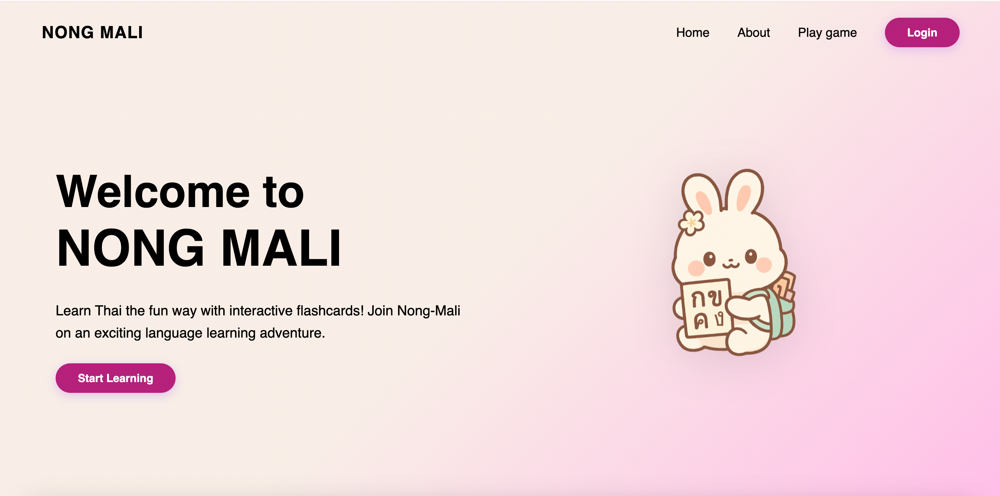

# 📘 **NONG MALI — Thai Learning Web App**

**NONG MALI** is an engaging web app designed to help users learn Thai vocabulary through interactive flashcards, progress tracking, and a clean, modern UI.

This project features:

* ✔ Java backend using **Spark Java**
* ✔ Static frontend (HTML, CSS, JS)
* ✔ Flashcard system with front/back flipping animation
* ✔ Token-based login authentication
* ✔ Modern, educational-inspired UI

---

## 📸 Preview / Screenshot



---

## 📂 Project Structure

```
webservice/
├── pom.xml                     # Maven configuration
├── src/
│   ├── main/
│   │   ├── java/org/global/academy/
│   │   │   ├── Server.java                 # Main backend server
│   │   │   ├── Flashcard.java              # Flashcard model
│   │   │   ├── ThaiConsonantFlashcard.java # Thai consonant cards
│   │   │   ├── UseCard.java                # Utility for flashcards
│   │   │   └── IntegerResponse.java        # Simple API response
│   │   └── resources/public/               # Frontend files
│   │       ├── index.html
│   │       ├── welcome.html
│   │       ├── about.html
│   │       ├── flashcards.html
│   │       ├── login.html
│   │       ├── index-style.css
│   │       ├── imgs/bunny.png
│   │       └── icons/
│   │           ├── bolt.svg
│   │           ├── brain.svg
│   │           ├── heart.svg
│   │           ├── inbox-icon.svg
│   │           ├── password-icon.svg
│   │           └── trophy.svg
└── target/                     # Compiled output
```

---

## 🚀 Running the Project

### 1. Build with Maven

```bash
mvn clean package
```

Generates:

```
target/spark-hello-1.0-SNAPSHOT-jar-with-dependencies.jar
```

### 2. Run the server

```bash
java -jar target/spark-hello-1.0-SNAPSHOT-jar-with-dependencies.jar
```

Access the app at:

👉 [http://localhost:8080](http://localhost:8080)

---

## 🎮 Flashcards Feature

`flashcards.html`:

* Loads flashcards via **GET /flashcards/default**
* Displays cards with flip animation
* Requires login (JWT token stored in `localStorage`)
* Uses clean UI and Thai fonts

**Flashcard JSON Example:**

```json
[
  { "front": "ก", "back": "Gaw Gai" },
  { "front": "ข", "back": "Khaw Khai" }
]
```

---

## 🔐 Authentication

Login handled via:

```http
POST /login
```

On success, the server returns:

```json
{
  "token": "jwt-token",
  "username": "example"
}
```

Client stores credentials:

```javascript
localStorage.setItem("token", token);
localStorage.setItem("username", username);
```

Without a valid token, users are redirected to `login.html`.

---

## 🖥 Frontend Pages

| File                | Description              |
| ------------------- | ------------------------ |
| **index.html**      | Welcome landing page     |
| **welcome.html**    | Post-login greeting      |
| **login.html**      | Login interface          |
| **flashcards.html** | Flashcards learning page |
| **about.html**      | About NONG MALI          |

---

## 🛠 Tech Stack

### Backend

* Java 17+
* Spark Java micro-framework
* Maven
* Gson (JSON serialization)

### Frontend

* HTML, CSS, JavaScript
* Custom UI inspired by modern educational apps

---

## 🌸 Philosophy

NONG MALI makes learning Thai:

* **Simple**
* **Fun**
* **Beautiful**
* **Beginner-friendly**

Learning should feel like playing, not studying ✨

---

## 📄 License

Educational use only.

---

## 💖 Author

Created by **Global Academy Students** during OOP class.
